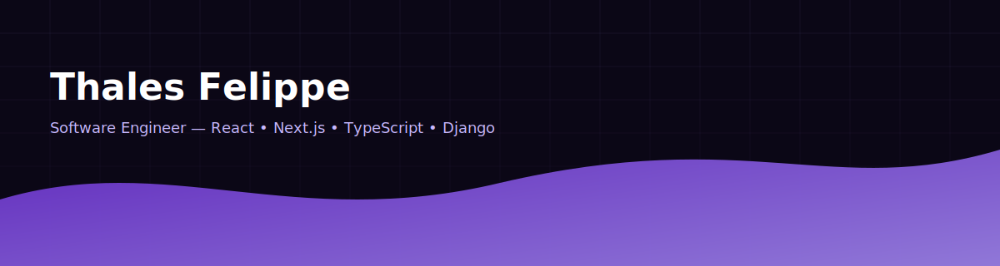

  

  
  
  
  

---

## ✨ Sobre mim
Sou **Software Engineer** focado em **React, Next.js, TypeScript e Django**, construindo produtos com estética moderna, acessíveis e **prontos para escalar**.  
Tenho fluência em **Git, CI/CD** e boas práticas de arquitetura. Estudo **Análise e Desenvolvimento de Sistemas** e curto explorar **IA aplicada** e **APIs performáticas**.

> missão: criar experiências simples por fora e robustas por dentro - com um visual **moderno e acessível**.

---

## 🧭 Radar Técnico
**Front-end:** React, Next.js, TypeScript, Vue, Tailwind, Styled Components, SASS  
**Back-end & APIs:** Django, Python, Node.js, MySQL, REST  
**DevX & Ops:** GitHub Actions, Docker, Postman  
**Design:** Figma, A11y, Microinterações

  
  
  
  
  
  
  

---

## 🔥 No que estou trabalhando
- **Arquitetura de back-end, performance de APIs e SQL**
- **IA aplicada a produtos (assistentes, automações, avaliação de qualidade)**
- **Game dev e mecânicas orientadas por IA (por hobby 😄)**

---

## 🤝 Vamos conversar?
Se você procura alguém que é **apaixonado** por **tecnologia** e em se manter sempre **atualizado**, entre em contato:
- [LinkedIn](https://www.linkedin.com/in/thales-felippe/)
- [E-mail](mailto:thales.dev.flp@gmail.com)

  

