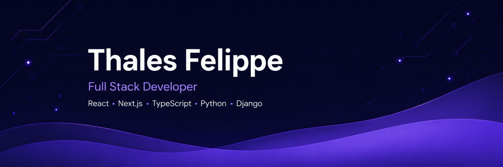

  

  
  
  
  

---

## 👋 Sobre mim

Sou **Full Stack Developer** com experiência desde 2021 construindo aplicações web para ambientes de **produto, fintech, SaaS e operação**.

Trabalho com **React, Next.js, TypeScript, Python, Django/DRF e APIs**, conectando front-end, back-end, integrações e regras de negócio para entregar sistemas estáveis, claros e fáceis de evoluir.

Nos últimos anos, atuei em plataformas financeiras e sistemas de gestão, desenvolvendo **jornadas de negociação, dashboards operacionais, chats em tempo real, integrações com WhatsApp/CRM, gateways de pagamento, emissão fiscal, assinatura eletrônica, webhooks, rotinas assíncronas e melhorias de observabilidade**.

---

## 🧭 O que eu construo

- **Produtos web e SaaS** com foco em clareza, estabilidade e evolução contínua
- **Dashboards e sistemas administrativos** para operação, gestão e tomada de decisão
- **APIs REST, integrações e webhooks** conectando sistemas internos e serviços externos
- **Fluxos financeiros e operacionais** com pagamentos, faturamento, CRM e automações
- **Interfaces responsivas e acessíveis** com React, Next.js, TypeScript e Tailwind

---

## 🛠️ Stack principal

**Front-end:** React, Next.js, TypeScript, JavaScript, Tailwind CSS, shadcn/ui  
**Back-end & APIs:** Python, Django, Django REST Framework, Node.js, Laravel, REST APIs  
**Banco de dados & filas:** PostgreSQL, MySQL, Redis, Celery  
**DevX & Cloud:** Docker, Git, GitHub Actions, CI/CD, Heroku, GCP  
**Integrações:** GalaxPay, Asaas, eNotas/NFS-e, DocuSign, Z-API, Twilio, RD Station, CRMs, Webhooks

  
  
  
  
  
  
  
  
  

## 📌 Atualmente

Estou buscando minha próxima oportunidade como **Full Stack Developer / Software Engineer**, com abertura também para vagas de **Frontend React/Next.js** e **Backend Python/Django**.

Tenho interesse em times que constroem produtos digitais, sistemas internos, plataformas SaaS, soluções financeiras, integrações, automações e ferramentas para operação.

---

## 🤝 Vamos conversar?

Se sua empresa precisa de alguém para **construir produto, integrar sistemas, resolver problemas e melhorar fluxos operacionais com software confiável e bem estruturado**, vamos conversar.

  
  

  

